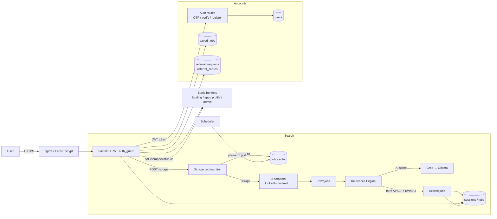

# JobAwn

> Live site: **[https://jobawn.com](https://jobawn.com)

## System Design

**Request flow:** `/app` → login (OTP → JWT, stored in sessionStorage) → `POST /scrape` → cache-first lookup or live scrape → keyword + LLM scoring → results streamed to the DB → frontend polls and renders.**

Automated job scraper + AI scoring + referral marketplace + web dashboard.

## How it works

1. **Scrape** — searches LinkedIn, Indeed, RemoteOK, WeWorkRemotely, Naukri, GulfTalent, EuroJobs for relevant roles across locations (results served cache-first for instant repeat searches)
2. **Score** — an LLM (Groq, Ollama fallback) scores each job against your resume on relevance, skills match, experience, and growth potential
3. **Filter** — top matches land in your dashboard for review
4. **Save & track** — bookmark jobs and manage your pipeline (saved → applied → interviewing → offer → rejected)
5. **Referrals** — see people at the companies you're applying to, request referrals, and earn credits through dual-confirmed referrals

## Features

- Email OTP login with stateless **JWT** tokens (24h expiry, no passwords)
- Profile with resume upload
- Saved jobs tracker with application-status management
- Referral marketplace: company directory, referral requests, acceptance → contact reveal, dual-confirmation + credit rewards
- Internship mode with stricter scoring
- Background prewarm scheduler that keeps job results pre-scraped and instant
- Admin dashboard: sessions, scores, registrations, visits, cache/prewarm stats, DB restore/merge

## Stack

- **Backend:** Python + FastAPI + Playwright + BeautifulSoup
- **Frontend:** HTML/CSS/JS dashboard served by FastAPI
- **AI:** Groq API (configurable to Ollama for local inference)
- **Scraping:** Multi-pass with rate limiting & rotating user-agents
- **Auth:** HS256 JWT + SMTP email OTP

## Configuration

Copy `config.example.py` to `config.py` and set API keys, email credentials, and search preferences. `config.py` is **gitignored** — server copy is the source of truth. See `docs/architecture/CODEBASE.md` and `docs/architecture/JWT_AUTH.md` for architecture and auth details. Full doc index: `docs/README.md`.

## Deploy

- **Production (live domain):** Docker on an Oracle Cloud VM behind nginx + Let's Encrypt (`jobawn.com`). Deploy/rollback steps in `docs/deployment/jwt_deploy_runbook.md`.
- **Render:** auto-deploys from GitHub via `render.yaml`
- **Hugging Face Spaces:** uses root `Dockerfile`, port 7860