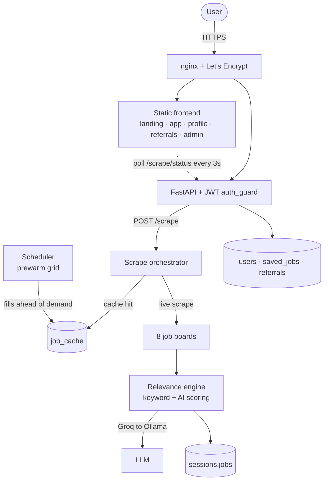

# JobAwn

Automated job scraper + AI relevance scoring + referral marketplace, wrapped in a web dashboard.

> **Live:** [https://jobawn.com](https://jobawn.com) · Search app: [`/app`](https://jobawn.com/app)

---

## Overview

JobAwn searches eight job boards at once, filters results against your resume, scores each job
with an LLM, and tracks your applications. Repeat searches are served **cache-first** from a
prewarmed job cache, so common role/location combinations return instantly.

- **Scrape** — LinkedIn, Indeed, RemoteOK, WeWorkRemotely, Naukri, GulfTalent, EuroJobs, Adzuna
- **Score** — `total = AI_score × 0.7 + keyword_score × 0.3` (Groq, Ollama fallback)
- **Track** — saved-jobs pipeline (saved → applied → interviewing → offer → rejected)
- **Referrals** — find people at target companies, request referrals, earn credits on dual confirmation
- **Admin** — sessions, scores, registrations, visits, cache/prewarm stats, DB restore/merge

## System design


```mermaid
flowchart TB
    User([User]) -->|HTTPS| Nginx[nginx + Let's Encrypt]
    Nginx --> FE[Static frontend<br/>landing · app · profile · referrals · admin]
    Nginx --> API[FastAPI + JWT auth_guard]

    API -->|POST /scrape| Orc[Scrape orchestrator]
    Orc -->|cache hit| Cache[(job_cache)]
    Orc -->|live scrape| Scr[8 job boards]
    Scr --> Match[Relevance engine<br/>keyword + AI scoring]
    Match -->|Groq to Ollama| LLM[LLM]
    Match --> Jobs[(sessions.jobs)]
    FE -.->|poll /scrape/status every 3s| API

    Sched[Scheduler<br/>prewarm grid] -->|fills ahead of demand| Cache
    API --> Data[(users · saved_jobs · referrals)]
```

**Request lifecycle**

1. Every `/api/*` request hits the JWT `auth_guard` middleware → `401` if the bearer token is missing/expired; admin routes additionally require the admin email.
2. `POST /scrape` checks the cache first. A fresh `job_cache` entry returns instantly; otherwise scraping runs in a background thread.
3. Raw jobs → `relevance_engine.filter_jobs()` → keyword + LLM scoring → results streamed into `sessions.jobs`.
4. The frontend polls `GET /scrape/status` every 3 seconds and renders incrementally.
5. A background **prewarm scheduler** fills `job_cache` ahead of demand.

## How it works

1. **Upload a resume** and pick a role + location. The LLM extracts keywords from the resume.
2. **Search** — the orchestrator resolves the location into per-board, per-market combos. Country-only searches fan out across a country's curated top states so results span the whole market.
3. **Cache** — warm entries are served immediately; stale/missing cells are scraped and topped up. Cache TTL and minimum volume are configurable (`CACHE_*`).
4. **Score** — keyword overlap plus a batched LLM pass; hallucinated skills are verified against the description, internships get stricter YOE filtering.
5. **Review** — top matches appear in the dashboard; save jobs and move them through your pipeline.
6. **Referrals** — see who already works at the companies you are applying to and request a referral.

## Features

- Email OTP login with stateless **JWT** tokens (HS256, 24h expiry, no passwords)
- Resume upload + LLM keyword extraction; internship mode with stricter scoring
- Cache-first search with a self-healing **prewarm scheduler**; country top-state fan-out
- User-discovered prewarm combos **self-prune** (deleted after 30 days idle unless searched at least twice)
- Saved-jobs tracker with application-status management
- Referral marketplace: company directory, requests, acceptance → contact reveal, dual-confirmation credits
- Admin dashboard: sessions, charts, registrations, visits, cache/prewarm stats, DB restore/merge

## Tech stack

| Layer | Technology |
|-------|------------|
| Backend | Python 3.11, FastAPI, Uvicorn |
| Scraping | HTTP (`requests`, BeautifulSoup), Playwright / undetected-chromedriver, JobSpy |
| AI | Groq API (primary) → Ollama (local fallback) |
| Storage | SQLite (`job_agent.db`) |
| Frontend | Vanilla JS modules + Tailwind CSS (CDN) |
| Auth | HS256 JWT (pure stdlib) + SMTP email OTP |
| Ops | Docker, nginx + Let's Encrypt, Oracle Cloud VM |

## Project structure

```
job-agent-ammar/
├── backend/
│   ├── api/
│   │   ├── main.py            # FastAPI app, JWT auth_guard, static pages, scheduler lifespan
│   │   ├── deps.py            # token -> user helpers
│   │   └── routes/            # scrape, auth, jobs, saved_jobs, profile, referrals,
│   │                          #   roles, states, resume, admin, stats, visits, leads, ...
│   ├── llm/                   # Groq → Ollama client, providers, prompt templates
│   ├── match_engine/          # relevance engine (keyword + AI scoring)
│   ├── scrapers/              # one module per job board (8 live boards)
│   ├── utils/                 # jwt, rate limiting, SMTP, PII scrubbing, experience level
│   ├── db.py                  # SQLite layer (schema, cache, prewarm, sessions)
│   ├── scheduler.py           # prewarm scheduler + job-cache GC
│   ├── config.example.py      # configuration template (copy to config.py)
│   └── tests/                 # pytest suite
├── frontend/
│   ├── landing.html           # `/`      public landing
│   ├── index.html             # `/app`   search app
│   ├── profile.html           # `/profile` saved jobs + referrals
│   ├── referrals.html         # `/referrals`
│   ├── admin.html             # `/admin`
│   └── js/                    # search.js (core), api.js, auth.js, admin.js, referrals.js, ...
├── docs/                      # architecture, planning, deployment guides
├── scripts/                   # ops helpers
├── Dockerfile                 # Hugging Face Spaces build (port 7860)
└── render.yaml                # Render.com deployment
```

## Quick start

### Prerequisites
- Python 3.11+
- Chromium (for browser-based scrapers); `python -m playwright install chromium` installs the Playwright build

### 1. Install

```bash
cd backend
pip install -r requirements.txt
python -m playwright install chromium
```

### 2. Configure

```bash
cp config.example.py config.py
```

Edit `config.py` and set at minimum `JWT_SECRET`, `ADMIN_EMAIL`, and the LLM/email credentials you need.
`config.py` is **gitignored** — the server copy is the source of truth, so never overwrite it blindly on deploy.

### 3. Run

```bash
cd backend
uvicorn api.main:app --host 0.0.0.0 --port 7860
```

Open `http://localhost:7860` (landing) or `/app` (search). The prewarm scheduler is controlled by
`SCHEDULER_ENABLED` in `config.py` and starts with the app.

### Tests

```bash
cd backend
python -m pytest tests/ -q
```

## Configuration

All runtime settings live in `backend/config.py` (start from `config.example.py`).

| Area | Keys |
|------|------|
| LLM | `LLM_PROVIDER`, `GROQ_API_KEY`, `GROQ_MODEL`, `GROQ_KEYWORDS_MODEL`, `OLLAMA_MODEL`, `OLLAMA_API_URL` |
| Auth | `JWT_SECRET`, `JWT_ALLOW_DEV_SECRET`, `JWT_ACCESS_TOKEN_MINUTES`, `ADMIN_EMAIL` |
| Cache / prewarm | `CACHE_TTL_HOURS`, `CACHE_MIN_VOLUME`, `CACHE_MAX_ENTRIES`, `CACHE_TOP_STATES`, `CACHE_ROLES`, `CACHE_COUNTRIES`, `PREWARM_WORKERS`, `PREWARM_MAX_COMBOS_PER_RUN` |
| Scheduler | `SCHEDULER_ENABLED`, `SCHEDULER_INTERVAL_MINUTES` |
| Scraping | `SCRAPE_LIMIT`, `MAX_CONCURRENT_PER_BOARD`, `NAUKRI_USE_PROXY`, `KEYWORDS_EXCLUDE`, `INTERNSHIP_KEYWORDS` |
| Email | `EMAIL_HOST`, `EMAIL_PORT`, `EMAIL_USER`, `EMAIL_PASSWORD`, `EMAIL_TO`, `SENDER_EMAIL` |

Key environment overrides are listed in [`docs/architecture/CODEBASE.md`](docs/architecture/CODEBASE.md)
(also `ADZUNA_APP_ID` / `ADZUNA_KEY` for the Adzuna board).

## Deployment

**Production (live):** Docker on an Oracle Cloud VM behind nginx + Let's Encrypt.

> Follow [`docs/deployment/DEPLOYMENT_RUNBOOK.md`](docs/deployment/DEPLOYMENT_RUNBOOK.md).
> Routine deploy is **`docker cp` + `docker restart`** — never recreate the container.
> Runtime data (`config.py`, `job_agent.db`, `resumes/`, …) lives inside the container and must
> never appear in a deploy bundle.

Other targets:

- **Render** — auto-deploys from GitHub via `render.yaml` (`backend/Dockerfile`).
- **Hugging Face Spaces** — root `Dockerfile` (port 7860).

## Documentation

- [docs/architecture/CODEBASE.md](docs/architecture/CODEBASE.md) — architecture, DB schema, routes, deploy
- [docs/architecture/HOW_IT_WORKS.md](docs/architecture/HOW_IT_WORKS.md) — scoring and workflow
- [docs/architecture/JWT_AUTH.md](docs/architecture/JWT_AUTH.md) — JWT auth flow
- [docs/deployment/DEPLOYMENT_RUNBOOK.md](docs/deployment/DEPLOYMENT_RUNBOOK.md) — production runbook
- [docs/README.md](docs/README.md) — full documentation index

## Notes

- Browser-based scrapers (Naukri, GulfTalent, EuroJobs, WeWorkRemotely) are rate-limited and may
  occasionally fail on a board; the orchestrator continues with the rest.
- Respect each board's terms of service and rate limits. This project is intended for personal use.
